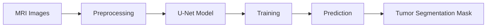

# Brain-Tumor-Segmentation-using-UNet-Architecture

````markdown
# Brain Tumor Segmentation using U-Net

A deep learning-based medical image segmentation project using the U-Net architecture for automated brain tumor segmentation from MRI scans. This project uses TensorFlow/Keras and OpenCV to train a semantic segmentation model on grayscale medical images and corresponding masks. :contentReference[oaicite:0]{index=0}

---

# Project Overview

Brain tumor segmentation is an important task in medical imaging that helps radiologists identify and analyze tumor regions in MRI scans.

This project implements:

- U-Net Architecture
- MRI Image Preprocessing
- Binary Mask Segmentation
- Dice Coefficient & IoU Metrics
- TensorFlow/Keras Training Pipeline
- Visualization of Predictions

The model learns to generate segmentation masks highlighting tumor regions from grayscale MRI scans.

---

# Features

- Custom U-Net implementation
- Medical image preprocessing pipeline
- Dice Coefficient evaluation
- IoU Metric evaluation
- Real-time prediction visualization
- TensorFlow/Keras based implementation
- OpenCV image handling
- GPU-supported training

---

# Dataset

The project uses a segmentation dataset containing:

- MRI Images
- Corresponding Tumor Masks

Dataset Structure:

```bash
segmentation_task/
│
├── train/
│   ├── images/
│   └── masks/
````

Total Samples:

* 3933 MRI images
* 3933 segmentation masks

---

# Technologies Used

* Python
* TensorFlow / Keras
* OpenCV
* NumPy
* Pandas
* Matplotlib
* Scikit-learn

---

# Model Architecture

The project uses the classic U-Net architecture consisting of:

## Encoder

* Convolution Blocks
* Batch Normalization
* ReLU Activation
* MaxPooling

## Bottleneck

* Deep feature extraction layer

## Decoder

* Conv2DTranspose upsampling
* Skip connections
* Feature concatenation

## Output Layer

* Sigmoid activation for binary segmentation

---

# Evaluation Metrics

The following metrics are used:

* Binary Cross Entropy Loss
* Dice Coefficient
* Intersection over Union (IoU)
* Accuracy

---

# Training Results

## Final Performance

| Metric                | Value  |
| --------------------- | ------ |
| Validation Accuracy   | 98.85% |
| Validation Dice Score | 0.4049 |
| Validation IoU        | 0.3398 |
| Validation Loss       | 0.0620 |

---

# Data Preprocessing

The preprocessing pipeline includes:

* Grayscale conversion
* Image resizing to 256×256
* Normalization
* Mask binarization
* Channel expansion

---

# Project Workflow



---

# Installation

## Clone Repository

```bash
git clone https://github.com/your-username/brain-tumor-segmentation-unet.git
cd brain-tumor-segmentation-unet
```

## Install Dependencies

```bash
pip install -r requirements.txt
```

---

# Required Libraries

```bash
tensorflow
opencv-python
numpy
pandas
matplotlib
scikit-learn
pillow
```

---

# Run the Project

```bash
python train.py
```

---

# Sample Prediction

The model predicts tumor masks from MRI scans.

### Input MRI → Ground Truth Mask → Predicted Mask

* Original MRI image
* Actual tumor segmentation mask
* Predicted segmentation mask generated by U-Net

---

# Future Improvements

* U-Net++ implementation
* Attention U-Net
* Dice Loss + BCE Combined Loss
* Data Augmentation
* Multi-class segmentation
* 3D MRI segmentation
* Transformer-based segmentation
* Attention Gates
* Mixed Precision Training

---

# Research Extension Ideas

This project can be extended into research areas such as:

* Attention U-Net for Brain Tumor Segmentation
* Lightweight U-Net for Edge Devices
* Cross-Modality MRI + PET Segmentation
* Semi-Supervised Medical Segmentation
* Few-Shot Tumor Segmentation
* Domain Adaptation in Medical Imaging

---

# Results Visualization

The project visualizes:

* Training Loss Curves
* Validation Loss Curves
* Dice Score Curves
* IoU Curves
* Predicted Segmentation Masks

---

# Folder Structure

```bash
project/
│
├── dataset/
├── notebooks/
├── models/
├── outputs/
├── train.py
├── predict.py
├── requirements.txt
└── README.md
```

---

# Author

Gunjan Soni

Computer Science Engineering Student
AI/ML & Medical Imaging Enthusiast

---

# License

This project is for educational and research purposes.

---

# Acknowledgements

* TensorFlow
* Keras
* OpenCV
* Medical Imaging Research Community
* U-Net Research Paper

---

# References

* U-Net: Convolutional Networks for Biomedical Image Segmentation
* TensorFlow Documentation
* OpenCV Documentation

```
```
